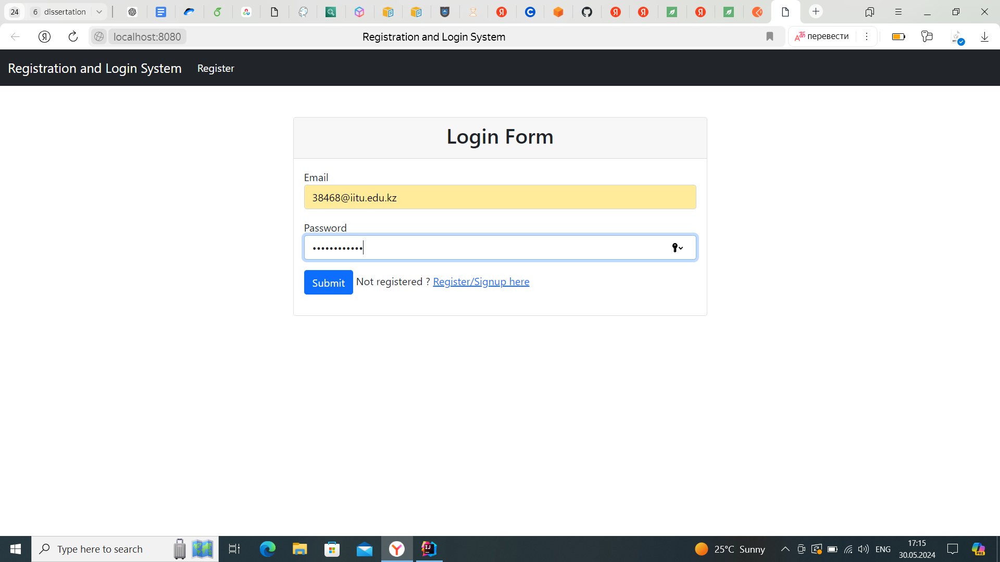
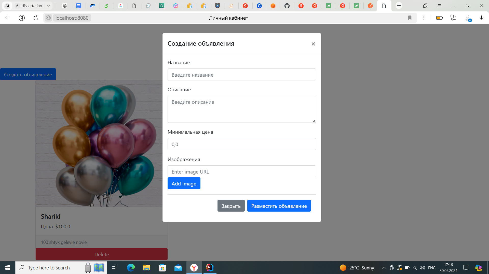
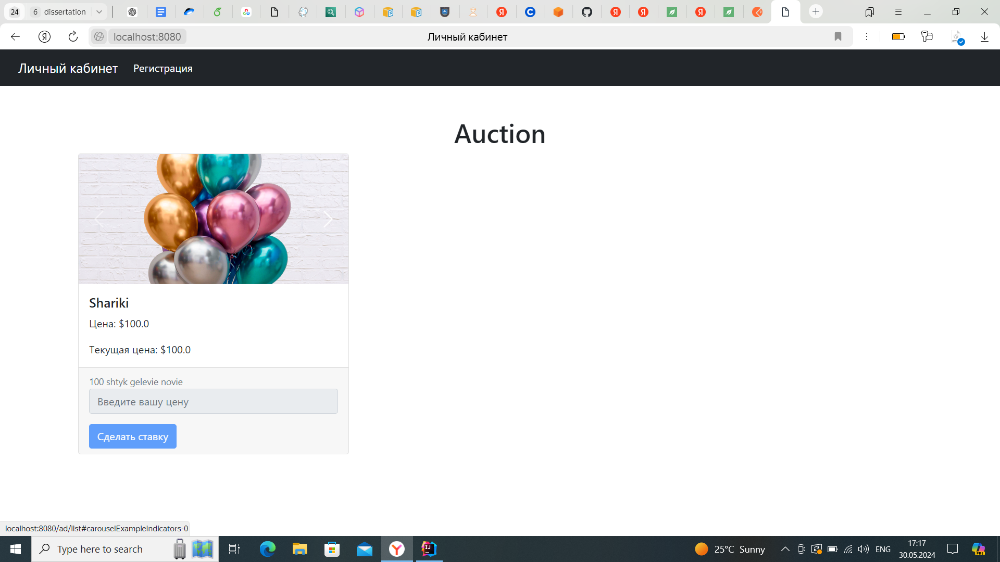

# My Spring Boot Project

## Requirements
- Java 11 (or higher)
- Maven 3.6.0 (or higher)

## How to Run

1. Clone the repository:
   ```bash
   git clone https://github.com/Nikita333111/Java-auction-pet-project.git
   cd repository
   mvn clean install
   mvn spring-boot:run
2. Configuration
   Edit the src/main/resources/application.properties file to set up your database and other configurations.
   ```bash
   spring.application.name=demo
    #DB conn
    spring.datasource.url=jdbc:postgresql://localhost:5432/dbname
    spring.datasource.username=username
    spring.datasource.password=password
    spring.datasource.driver-class-name=org.postgresql.Driver
    
    
    spring.jpa.properties.hibernate.dialect=org.hibernate.dialect.PostgreSQLDialect
    spring.jpa.hibernate.ddl-auto=update
    
    #conf for auction time
    auction.duration.minutes=1
    
    logging.file.name=logs/app.log
    logging.level.com.example.registrationlogindemo=INFO
    logging.config=classpath:logback-spring.xml
   
3. Требования по которым создавался проект указаны в директории requirements
4. Краткая визуализация страниц проекта:
    лог\рег с spring security (доступ к страницам и ролями) 
   
   Профиль с списком своих объявлений, приветстием, кнопкой создания объявления, кнопкой удаления объявления.
   
   Список всех объявлений.
   


